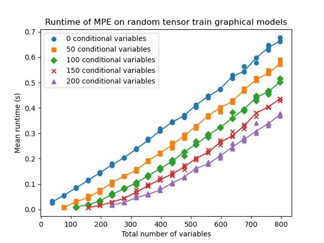
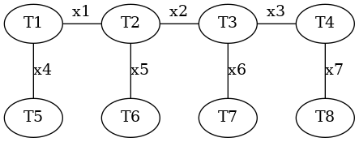

# Tensor MPE

- [What it does](#what-it-does)
- [File Contents](#file-contents)
- [Requirements](#requirements)
- [Build](#build)
- [Usage](#usage)

## What it does

This repository is a proof-of-concept implentation of MPE in tensor networks. It uses derivatives of a tensor contraction over the tropical (max-plus) semiring, that maximizes the probability in a discrete graphical model.
The main file to execute is `src/runtime.py`. When you execute this program, it first generates hidden markov models.
It generates a bunch of random queries for each model that you can customize in `src/random_benchmarks.py`.
Then, for each model, every query is run 10 times and the runtimes are plotted in `graphics/runtimes.png`.



### Model & Query Generation

The generated models are tensor trains. Given the tensor train has length $n$, then the model has $2n - 1$ variables, where the first $n - 1$ variables are hidden, and the last $n$ variables are observed.



#### Parameters for model generation

| Parameter         | Description                                         | Default |
| ----------------- | --------------------------------------------------- | ------- |
| axis_size         | axis size that is common for all tensors in a model | 64      |
| min_chain_length  | minimum number of tensors in a model                | 20      |
| max_chain_length  | maximum number of tensors in a model                | 400     |
| chain_length_step | step size for the number of tensors in the models   | 20      |

#### Parameters for query generation

| Parameter                       | Description                                                            | Default |
| ------------------------------- | ---------------------------------------------------------------------- | ------- |
| min_n_given                     | minimum number of variables that is conditioned on                     | 0       |
| max_n_given                     | maximum number of variables that is conditioned on                     | 200     |
| n_given_step                    | step size for picking the number of variables that is conditioned on   | 50      |
| queries_per_number_of_variables | Number of random queries generated for each picked number of variables | 3       |

## File Contents

- `src/graphical_model.py`: Graphical model class with functions for MPE and log probability.
- `src/my_bitsets.py`: Simple bitset implementation. This is useful because we want ordered, hashable sets of variables.
- `src/contractions.py`: Simple implementation of an tensor contraction along a contraction path.
- `src/tropical_bmm.hpp`, `src/tropical_bmm.cpp`: C++ implementation of a batch-matrix-multiplication in the tropical semiring with forward and backward mode for autograd.
- `src/bmm_interface.pyx`: Cython interface for the C++ implementation.
- `src/tropical_pairwise_einsum.py`: Interface for pairwise einsum which is used for small contractions along the contraction path. Uses the Cython interface to create a tropical batch-matrix-multiplication torch module.
- `src/random_benchmarks.py`: Generates random models and random queries for each model. It is automatically seeded, but you can disable that with the flag `auto_seed = False`.
- `src/runtime.py`: Uses `src/random_benchmarks.py` to generate random models and benchmarks the MPE implementation on it.

## Requirements

The requirements are:

```text
cython pytorch opt_einsum tqdm matplotlib
```

You can install them using

```text
pip install -r requirements.txt
```

or

```text
conda install --file requirements.txt
```

## Build

You need to build the Cython interface before being able to use the tropical bmm:

```text
cythonize -i src/tropical_bmm.pyx
```

## Usage

The main program has no command line arguments, so just execute it with

```text
python src/runtime.py
```

If you want to change the parameters, just change them in the main function.
